Hi there! I'm a new developer and I'm trying to create my own backend API for our project called **Florida Man Stories**. Firebase Functions is a cloud-hosted backend service that allows you to write serverless code in JavaScript. Florida Man project is about collecting every single news, that either includes 'Florida' or 'Florida Man'. This way users in Florida or people who want to get their crazy Florida news can access news much easily.

But why are we using Firebase Functions for this? There are couple of reason;
1. This project could attract more people then a single computer can handle. I mean my serverless function code can scale to hundreds of servers. If there are thousands of people requesting same function, Firebase Functions will handle it.
2. Firebase Functions is a cloud-hosted backend service that allows you to write serverless code in JavaScript or TyoeScript. So if you want to create your own backend API using JavaScript, you can use Firebase Functions.
3. You only pay for the amount of time spend on your function. You don't need to pay for hourly instances, you don't use.
4. Firebase automatically distributes your functions to the best available regions. This way you don't need to worry about which region to use.

So let's get started on how to create your own backend API.

## Step 1: Create a Firebase project
Go to you Firebase console and click 'Add Project'.
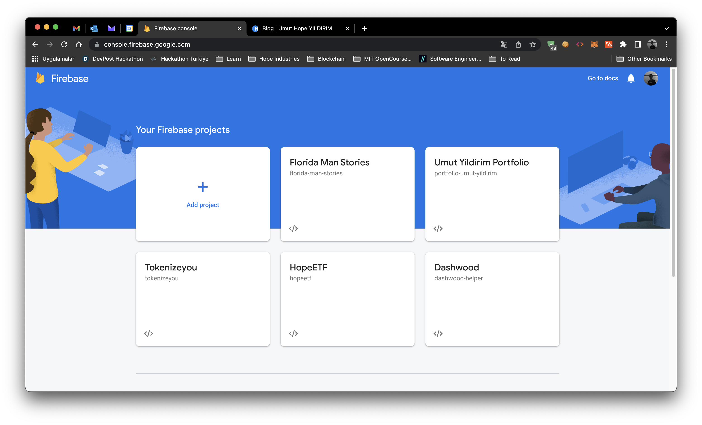

You will be asked to enter a name for your project. Enter a name for your project and click 'Create'.
If you want to add Google Analytics to your project, switch on the Google Analytics option and click 'Continue'.
If you selected the Google Analytics option, you will be asked to choose a Google Analytics account. Choose a Google Analytics account and click 'Create'.
If you are seeing welcome page after creating a new project, it means you have successfully created a new Firebase project.

## Step 2: Upgrade Project to Enable Functions
Unfortunately, you have to upgrade your project to enable Firebase Functions. Click 'Upgrade Project' and create a budget.
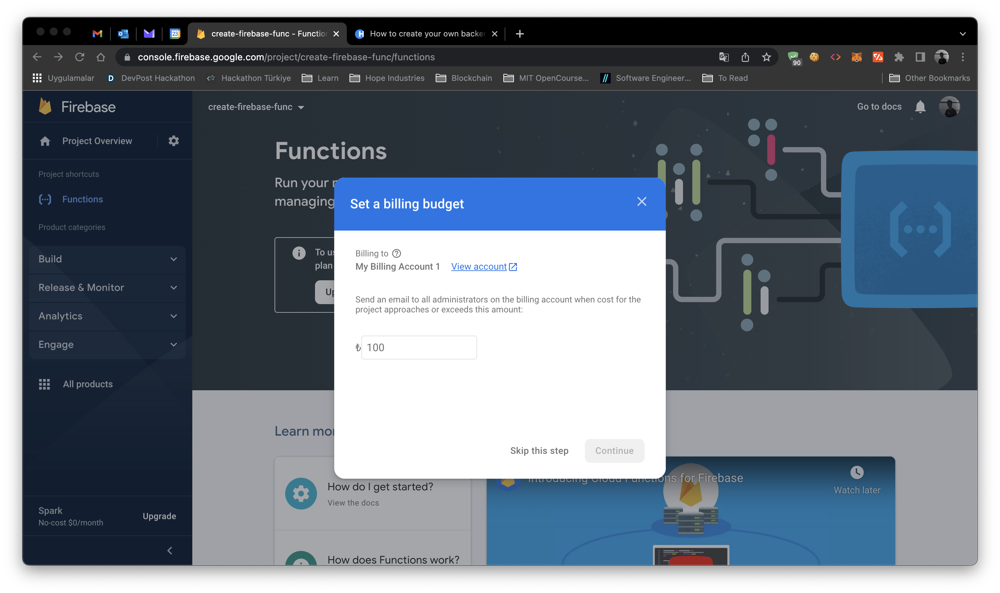
After creating a budget, click 'Purchase' to activate your plan.
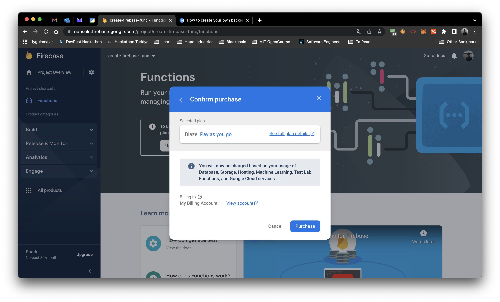
Now you can enable Firebase Functions by clicking 'Get Started'. You will be given an npm package install command. 
```bash
npm install -g firebase-tools
```
Copy the code above and run it in your terminal. If you encounter any error, try adding **'sudo'** in front of the command and run it again. If you no longer see any error, you have successfully installed Firebase CLI. Now we can setup our project. Change your directory to the root of your project and run the following command.
```bash
firebase init
```
You will be asked to sign in to your Google account. Sign in and click 'Continue'. After signing in, you need to run the following command to setup your project. If you didn't signed in you need to use the command below.
```bash
firebase login
```
After signing in, you will need to initialize your project. You can initialize your project by running the following command.
```bash
firebase init
```
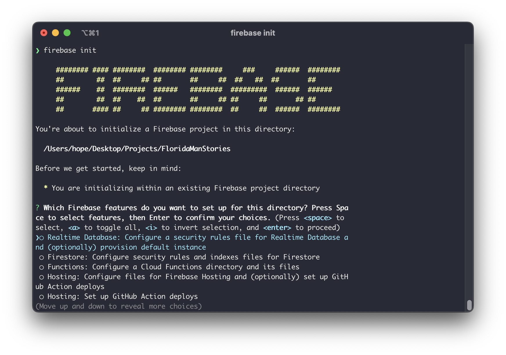
To enable Firebase Functions, you need to toogle on the 'Functions' option and press enter to finish your setup.
Now you will see a few options. You need to select 'Use existing projects' and select your project with space and press enter key to select your project.
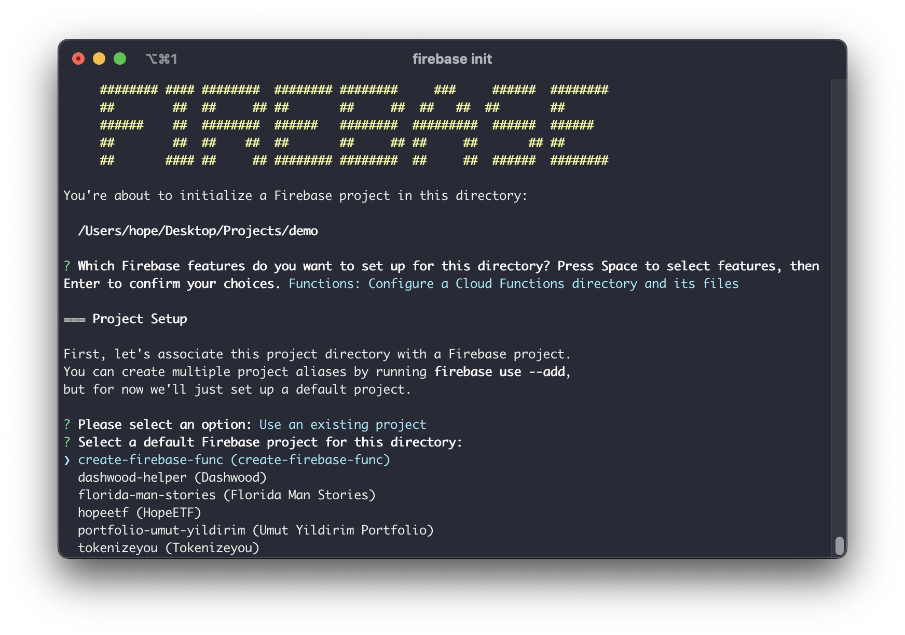
After selecting your project, you will see a list of available languges. Since we will be using JavaScript, you need to select 'JavaScript' and press enter key to select JavaScript.
After that selection you need to type 'n' to skip testing and type 'y' to install dependencies. Now you have successfully initialized your project and there should be a new folder called 'functions'.
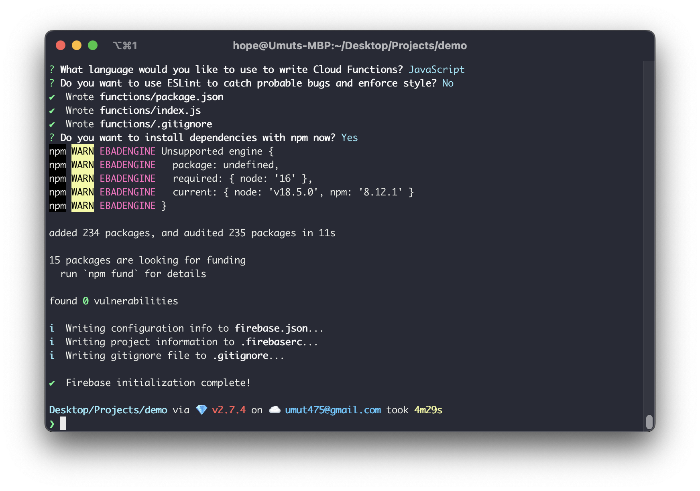

## Step 3: Create a Function
After completing the setup, your project folder should look like this.
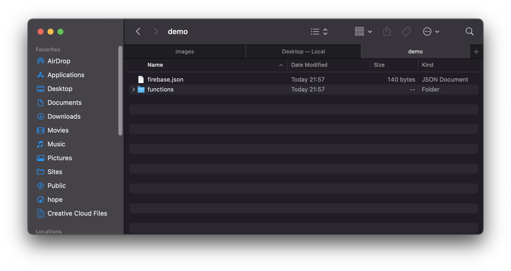
Now you can start editing your functions in Visual Studio Code. Open VSCode inside your projects root folder. This how your VSCode look like.
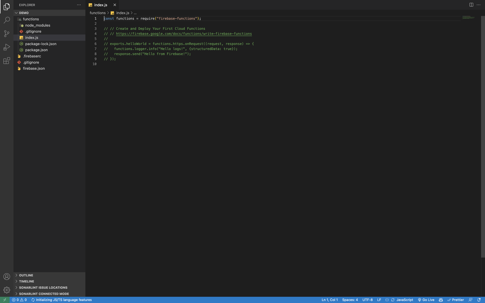
Now you can start editing your functions. Open the file 'index.js' inside 'functions' folder and start editing. You need to uncomment the following code.
```js
exports.helloWorld = functions.https.onRequest((request, response) => {
  functions.logger.info("Hello logs!", {structuredData: true});
  response.send("Hello from Firebase!");
});
```
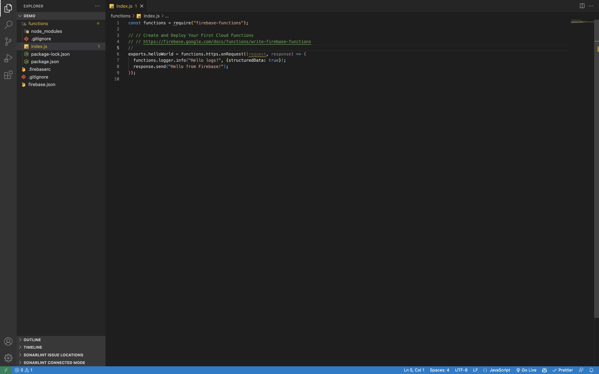

## Step 4: Deploy Your Functions
Now you can deploy your functions. Open the terminal inside your VSCode and type the following command.
```bash
firebase deploy
```
After waiting for a few minute, you will see a message saying '✔  Deploy complete!'.
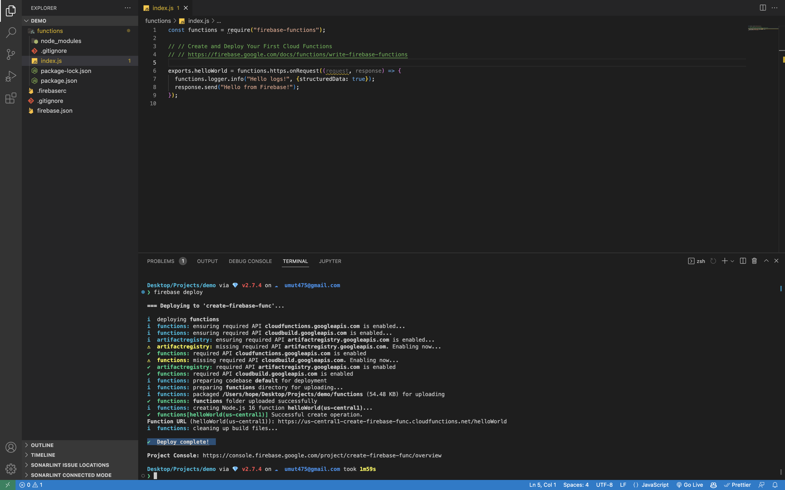
Now let's go back to Firebase Console and click 'Finish' button to see your deployed functions.
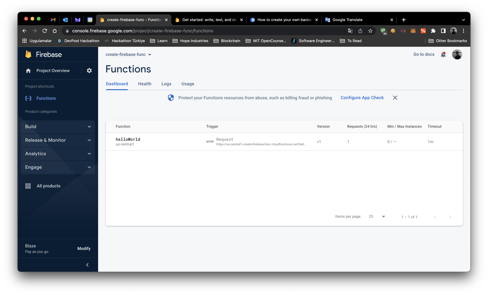

## Step 5: Test Your Functions
Now you can test your functions by hovering over url under 'Trigger' table.
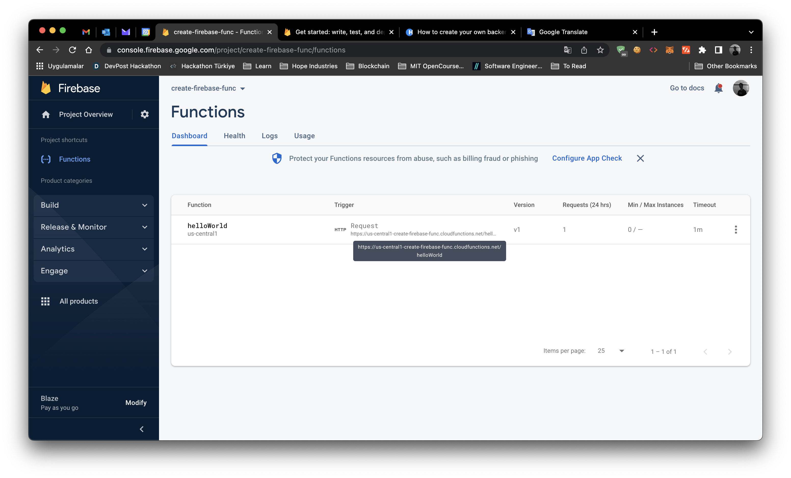
Copy the URL and paste it in your browser. You should see the message 'Hello from Firebase!'.
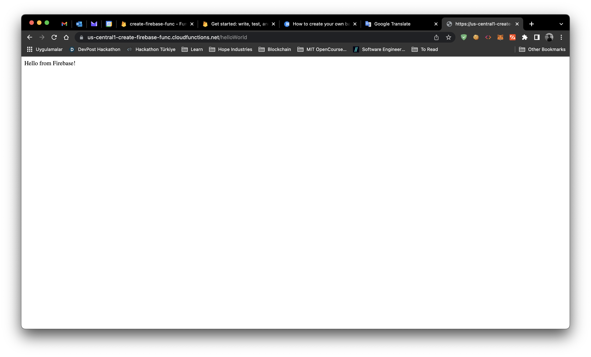
Congratulations! You have successfully created your own backend API and deployed it to Firebase. Now you can access your backend API from anywhere in the world.
With this tutorial, you have learned how to create your own backend API using Firebase Functions. You can also create CRON jobs in Firebase using Google Cloud Scheduler.