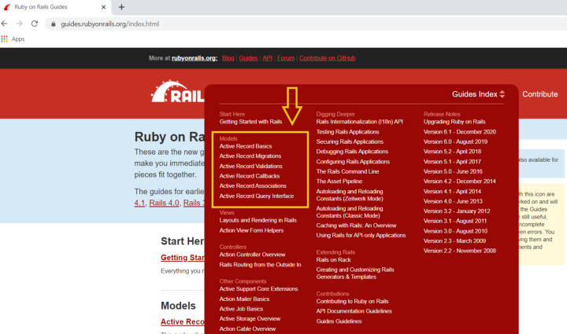
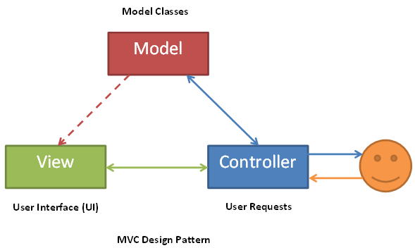
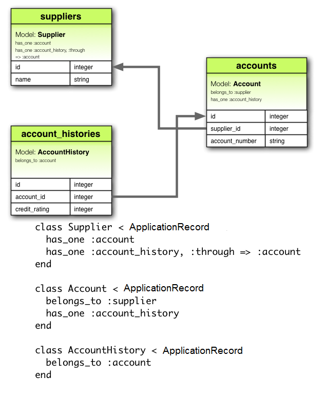

It doesn't matter if you are a beginner or a seasoned developer. From time to time, you need to look up certain programming language documentation to help you navigate through specific information to build up your application which then solves a definite task or problem. However, this skill is especially important for beginner developers since beginner developers, like myself, don't have many experiences in using built-in methods nor understanding how to implement the methods and the keywords to look for. For example, some methods require certain numbers of parameters, or even just simply land on the right page on the documentation.

<!-- truncate -->

The purpose of this article is to assist and guide other beginner developers on where to start when they read and refer to Ruby built-in methods in [Ruby on Rails Guide](https://guides.rubyonrails.org/index.html). This time I am going to focus on introducing the Models section which is related to setting up your backend database from scratch. 

Before diving into the Models, let’s take a look at what Active Record is first. We know that Rails contains seven Ruby gems, which work harmoniously together, and Active Record is one of them and taking care of all the database stuff, also known as an “ORM”. ORM stands for Object-Relational-Mapping and it means Active Record stores data in a database table kind of structure using rows and columns and the data can be modified or retrieved by writing SQL statements. Moreover, Active Record allows you to interact with that data as if it’s a normal Ruby object.

## What is Active Record?

 Active Record is the M in MVC — the model — which is the layer of the system responsible for representing business data and logic. Active Record facilitates the creation and use of business objects whose data requires persistent storage to a database. It is an implementation of the Active Record pattern which itself is a description of an Object Relational Mapping system.

## What is UML?

 UML, short for Unified Modeling Language, is a standardized modeling language consisting of an integrated set of diagrams, developed to help system and software developers for specifying, visualizing, constructing, and documenting the artifacts of software systems, as well as for business modeling and other non-software systems. The UML represents a collection of best engineering practices that have proven successful in the modeling of large and complex systems. The UML is a very important part of developing object oriented software and the software development process. The UML uses mostly graphical notations to express the design of software projects. Using the UML helps project teams communicate, explore potential designs, and validate the architectural design of the software. In this article, we will give you detailed ideas about what is UML, the history of UML and a description of each UML diagram type, along with UML examples.

## All About Active Record Migrations

Now you understand Models section is related to setting up your backend database but still where should you start looking? First thing first, we need to define our schema so our apps know what type of data they are receiving and storing. This is the time you can refer to the Active Record Migrations page to review some migration definitions that are supported by the built-in change method, as below: (To see a full list, you can visit here)

- `add_column`
- `add_foreign_key`
- `create_join_table`
- `create_table`
- `drop_join_table`
- `drop_table` (must supply a block)
- `remove_column` (must supply a type)
- `remove_foreign_key` (must supply a second table)
- `rename_column`
- `rename_index`
- `rename_table`

After all, we are humans and we make mistakes, or after a while, you need to change the database table, such as adding or removing columns, based on the new business decision and your supervisor needs you to make the changes. You may or may not remember how to make the change so it’s the place you can find the information you need.

## All About Active Record Associations

Now after we have the ideas of how we would like to define the schema, we also need to think about the relationship between each database table. For example, we have a table to store all the books and another table contains all the book authors. Should we use has_many and belongs_to types of association or has_and_belongs_to_many association? Since there may be a case that one book has more than one author. When you come across association-related questions that you can search for the Active Record Associations page.

## All About Active Record Query Interface

Eventually, you would like to retrieve the data from the database after you have finished all the database creation and it’s the moment you would like to spend your time studying Active Record Query Interface page which covers different ways that you can interact with your data using Active Record. Personally, Active Record Query Interface is the one that I visit the most, and easily get confused about which finder method should I use and how many arguments that I can pass into the method.

Below is a list of often used finder methods:

- `find`
- `extending`
- `from`
- `group`
- `having`
- `includes`
- `joins`
- `lock`
- `none`
- `order`
- `reorder`
- `reselect`
- `reverse_order`
- `select`
- `where`

For retrieving a single object, below are the methods you can consider:

- `find`
- `take`
- `first`
- `last`
- `find_by`

For retrieving multiple objects in batches, below are the methods you can consider:

- `find_each`
- `find_in_batches`
- `first`
- `last`
- `find_by`

Although, some of the finder methods you may think their functions look similar at first, you should always double-check what are their expected return result and decide which method you should use. For example, how do you decide when to use find_by, where or find if you want to search for data from the database?

Use `find_by` , if you’re expecting a single record or `nil` as a return Use `where` , if you’re expecting an `ActiveRecord::Relation` object as a return Use `find_by` , if you’re expecting a single record (by its primary column, usually `id` ) as a return Key Takeaway

Knowing and understanding where you get stuck is the key before you jump right into the Ruby on Rails Guide and start looking for answers. Ask yourself this question first — At what step am I having a problem now? Is it migration, association, or retrieving the data (query interface)?

## Resources

- https://guides.rubyonrails.org/active_record_basics.html
- https://www.theodinproject.com/courses/ruby-on-rails
