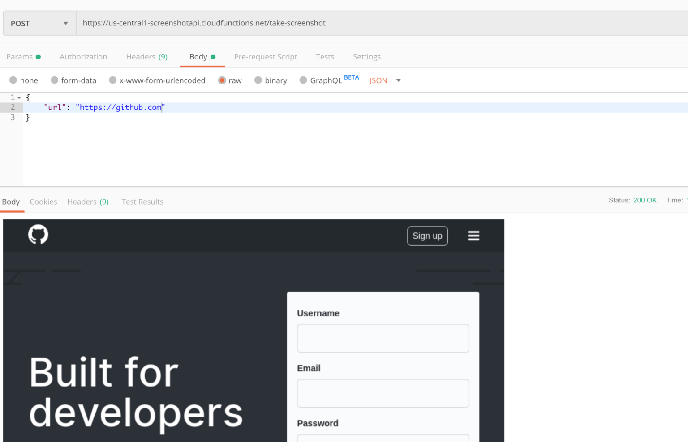

In this blog post, I describe the steps I took to set up this API, let’s dive in!

## Puppeteer
[Puppeteer](https://developers.google.com/web/tools/puppeteer) is a node package that allows you to control a headless chrome browser using Javascript. A headless chrome browser is just a browser without a window.

I can use this package to spin up a headless chrome instance, navigate to a website and take a screenshot.

To start I’m going to create a local node project and install the puppeteer package.

```bash
npm init
npm install puppeteer
```

Now I can create a file called `index.js` and add the following code.

```js
const puppeteer = require('puppeteer');

takeScreenshot()
.then(() => {
  console.log("Screenshot taken");
})
.catch((err) => {
  console.log("Error occured!");
  console.dir(err);
});

async function takeScreenshot() {
  const browser = await puppeteer.launch();
  const page = await browser.newPage();
  await page.goto("https://medium.com", {waitUntil: 'networkidle2'});


  const buffer = await page.screenshot({
		path: './screenshot.png'
  });

  await page.close();
  await browser.close();
}
```

Note that I am making the `takeScreenshot()` function `async`. This way I can use the await keyword in the function to wait for all the promises.

After running the code I get the following screenshot! 🎉


## Google Cloud Functions
So I now have a local script that I can call to take a screenshot, but I want to build an API. The next logical step is to put this script on a server somewhere.

I don’t want to worry about my server running out of memory, so I’m going to put it on [Google Cloud Functions](https://cloud.google.com/functions/). This way it can handle a huge number of requests without me having to worry about buying more RAM memory.

Once I have the cloud function running, I can call it with an HTTP request — meaning that I will have a working screenshot API 🚀

Let’s port the previous code to the Google Cloud Function format. The cloud function I created is `async` and called `run()`.

So far I have a working screenshot API. But I’m going to extend it by uploading the screenshots directly to Google Storage.

I’m going to use the `@google-cloud/storage` npm package for this.
Note that I have created a Google Cloud Storage bucket called `screenshot-api` checkout [this page](https://cloud.google.com/storage/docs/quickstart-console) for how to set up a storage bucket.

```js
const puppeteer = require('puppeteer');
const { Storage } = require('@google-cloud/storage');

const GOOGLE_CLOUD_PROJECT_ID = "portfolio-umut-yildirim";
const BUCKET_NAME = "screenshot-jobs-portfolio-umut-yildirim";

exports.run = async (req, res) => {
  res.setHeader("content-type", "application/json");
  
  try {
    const buffer = await takeScreenshot(req.body);
    
    let screenshotUrl = await uploadToGoogleCloud(buffer, req.body.name+".png");
    
    res.status(200).send(JSON.stringify({
      'screenshotUrl': screenshotUrl
    }));
    
  } catch(error) {
    res.status(422).send(JSON.stringify({
      error: error.message,
    }));
  }
};

async function uploadToGoogleCloud(buffer, filename) {
  const storage = new Storage({
    projectId: GOOGLE_CLOUD_PROJECT_ID,
  });

  const bucket = storage.bucket(BUCKET_NAME);

  const file = bucket.file(filename);
  await uploadBuffer(file, buffer, filename);
  
  await file.makePublic();

  return `https://${BUCKET_NAME}.storage.googleapis.com/${filename}`;
}

async function takeScreenshot(params) {
	const browser = await puppeteer.launch({
		args: ['--no-sandbox']
	});
	const page = await browser.newPage();
	await page.goto(params.url, {waitUntil: 'networkidle2'});

	const buffer = await page.screenshot();

	await page.close();
	await browser.close();
  
  return buffer;
}

async function uploadBuffer(file, buffer, filename) {
  return new Promise((resolve) => {
    file.save(buffer, { destination: filename }, () => {
      resolve();
    });
  })
}
```
The new result — My postman client is showing the URL to the screenshot 🚀

Note that in the code above each screenshot is saved as screenshot.png on Google Storage. In the real world, you would need to generate a random id for each image.

## Conclusion
Here’s the source of a [Google Cloud function](https://cloud.google.com/functions/) that, using [Puppeteer](https://pptr.dev/), takes a screenshot of a given website and store the resulting screenshot in a bucket on Google Cloud Storage.
This was a fun project to do. 

You can find the source code of the completed [Google Cloud function](/gists/f2e970cc8ee394de3f58c7a72da0f835) and [package.json](/gists/b19cdf20c40b84d39e6618f6e6db2531) here. 

Thanks for reading!