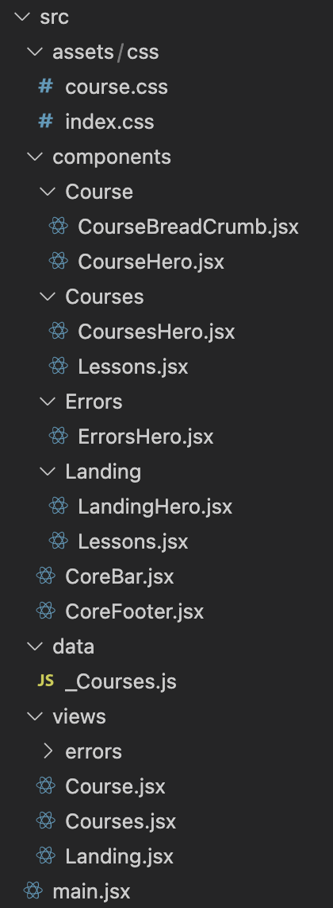
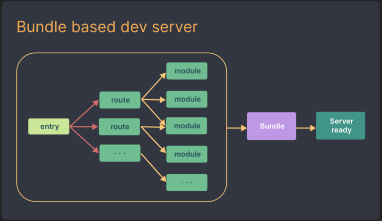
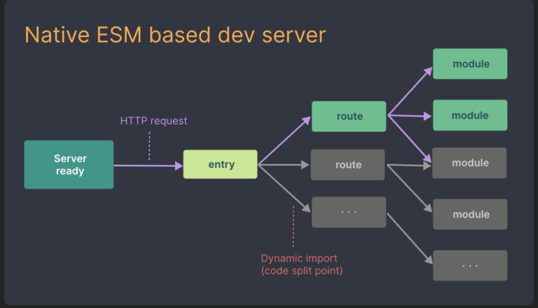

## Flatiron School
[Flatiron School](https://flatironschool.com/) is a 15-week coding bootcamp, with courses in software engineering, data science, cybersecurity, and product design.

Upon completion of the course, students lose access to the internal class portal, called Canvas. Students are provided with html and javascript data files, containing information on the modules and courses used throughout the phases of the bootcamp.

## Flatiron Open Source
The challenge we [Hope](https://github.com/umuthopeyildirim), [Ian](https://github.com/igottheim/) set out of accomplish is how to make the data provided upon graduation user friendly for future review and preparation for interviews. This is what sparked the idea for Flatiron Open Source. The goal was to recreate the internal class portal for Flatiron graduates to use and collaborate. 

This blog will run through the process to create the front end, while future blogs will discuss back end and user implementation

## How we structured our front-end

### assets/css
  - css setup and configuation with tailwind
### components           
  - This is where the site components are created for the specific site modules. Information has been passed down using params.
### data
  - Used for params for routing to the correct links to the backend
### views 
  - This is where the components are rendered. Items from the components page are imported into views.
## main
  - The main jsx file that gets rendered for the script for index.html. The views are imported into main, where react router is used to move through the different data.




## Tailwindcss/DaisyUI
CSS styling was completed using the DaisyUI plugin for TailwindCSS. The inclusion of DaisyUI makes creating components seamless, and if needed allows for customization.

To get started, you must have the runtime environment, Node.js, installed, to use the package manager npm commands. Another option, which was used for this project, is to have [yarn](https://yarnpkg.com/getting-started/install) installed on your computer. 

The documentation for tailwind can be found [here](https://tailwindcss.com/docs/installation)

### Step 1 Install the required packages
```bash
yarn add -D tailwindcss postcss autoprefixer
yarn tailwindcss init -p
yarn add daisyui
yarn add react-daisyui
```

### Step 2 Set Up your tailwind.config.js files
Source code for Flatiron Open Source tailwind.config.js file can be found [here](https://github.com/umuthopeyildirim/FlatironOpenSource/blob/main/tailwind.config.js)

The most important piece of the source code is the additional plugin to require daisyUI.


### Step 3 Add the Tailwind directives to your CSS

Source code for Flatiron Open Source tailwind directives can be found [here](https://github.com/umuthopeyildirim/FlatironOpenSource/blob/main/src/assets/css/index.css).

That is all you need to do. The final piece is the read the documentation, and import DaisyUI components you would like to use to make styling seamless for your project. 

## Client Side Routing
In a React application, client-side routing refers to the process of navigating to different pages or views within the app by updating the URL in the browser, without triggering a full page reload. This allows for a smoother and more efficient user experience, as the app can quickly update the displayed content without having to fetch it from the server.

One popular library for implementing client-side routing in a React app is React Router. React Router provides a collection of components that can be used to declaratively define the different routes in your app and the components that should be displayed for each route. 

Vite is a build tool that is well suited for building SPA (Single-Page Applications) with React, it provides a fast development experience with a simple setup, it also provides built-in support for client-side routing by using ES modules and it's live-reloading feature.

You can use Vite with React Router to handle client-side routing in your app. You'll need to install React Router;
```bash
yarn add react-router-dom
```
Then import `react-router-dom` to your `main.jsx`.
This is our example;
```javascript
import React from 'react';
import ReactDOM from 'react-dom/client';
import { BrowserRouter, Routes, Route } from "react-router-dom";
import './assets/css/index.css';

// Routes
/* Landing Pages */
import Landing from './views/Landing';
import Courses from './views/Courses';
import Course from './views/Course';

/* Error Pages */
import NotFound from './views/errors/NotFound';

ReactDOM.createRoot(document.getElementById('root')).render(
  <React.StrictMode>
    <BrowserRouter>
      <Routes>
        {/* Landing Pages */}
        <Route path="/" element={<Landing />} />
        <Route path="/courses/:course" element={<Courses />} />
        <Route path="/course/:course/:phase" element={<Course />} />

        {/* Error Pages */}
        <Route path='/*' element={<NotFound />} />
      </Routes>
    </BrowserRouter>
  </React.StrictMode>
);
```

## IDs and courses.js
Now you might ask, what is this;
```javascript
<Route path="/course/:course/:phase" element={<Course/>}/>
```
We are using `useParams` react hook from `react-router-dom` to recieve data from URL.
`:course` is course ID like `product-design` so we can request related data from `courses.js`.

The `useParams` react hook allows for dynamic routing, in this case used for the url slug. It also helps to dynamically render the correct data for the course page.

## Why [Vite 3](https://vitejs.dev/)

In most React applications, software engineers use the command below to scaffold React projects:

```bash
create-react-app <app-name>
```
The downsides to this command is speed. Create-React-App is a bundle based development server. It uses webpack, which bundles the application code before serving. The larger the codebase, the more time this will take. 



Vite is a front-end Native ESM based development server with several advantages over create-react-app:
- It takes advantage of the availability of native ES modules in the browser, and the rise of JavaScript tools written in compile-to-native-languages
- Vite enhance start time by dividing the modules in an app into **dependencies** and **source code**
  - Dependencies: plain JavaScript that does not       change during development (component libraries). Dependencies are pre-bundled using [esbuild](https://esbuild.github.io/.).
  - Source Code: non-plain JavaScript that needs transforming (JSX/CSS components). Source code is served over [native ESM](https://developer.mozilla.org/en-US/docs/Web/JavaScript/Guide/Modules).Vite only serves source code as the browser requests the data
and the data is currently being used.
  -Vite supports Hot Module Replacement (HMR) over native ESM. When a file is edited, VITE only needs to invalidate one chain between the edited module and the closest boundary, instead of re-constructing the entire site as a bundler


The documentation found [here](https://vitejs.dev/guide/) will help you start a project with vite.

```bash
yarn create vite
yarn create vite my-react-app --template react
```
## Google Analytics
`vite-plugin-radar` is a Vite plugin that allows you to easily add Google Analytics and Google Tag Manager to your website.

To use the plugin, you'll first need to install it as a dependency:
```bash
yarn add vite-plugin-radar
```
Then, you need to register it in your vite.config.js file:
```javascript
import { defineConfig } from 'vite';
import react from '@vitejs/plugin-react';
import ViteRadar from 'vite-plugin-radar'

// https://vitejs.dev/config/
export default defineConfig({
  plugins: [
    react(),
    ViteRadar({
      // Google Analytics tag injection
      analytics: {
        id: 'G-QYFSS4RFJQ',
      },
      gtm: {
        id: 'GTM-TTWKD6W',
      },
    })
  ],
})
```
Here, `analytics` is your **Google Analytics** tracking code, which is used to track the user's actions and behavior on your website. `gtm` is your **Google Tag Manager** container code, which is used to manage your analytics tags.

Once this is done, the plugin will automatically add the required **GA** and **GTM** scripts to your HTML page and configure them based on the options you provided in the configuration.

Please note that The plugin is in beta state and its API might change, you might want to consult the [**documentation**](https://github.com/stafyniaksacha/vite-plugin-radar) of the plugin for the most **up-to-date** information.

## Responsive Design
Responsive design is a method of designing and building websites that adapt to the different screen sizes and devices that people use to access the web. It's important because more and more people are accessing the internet from a variety of devices, including smartphones, tablets, laptops, and desktops.

Tailwind CSS is a popular utility-first CSS framework that can be used to build responsive designs. It provides a wide variety of utility classes that can be used to apply CSS styles to HTML elements quickly and easily. These classes are designed to be highly composable, which means you can use them together in different combinations to create complex layouts and designs.

One of the ways Tailwind CSS helps with responsive design is through its use of "responsive prefixes" that can be added to utility classes. These prefixes allow you to apply different styles to an element based on the size of the screen. For example, you can use the "sm" prefix to apply a style only when the screen is at least 768 pixels wide, or the "lg" prefix to apply a style only when the screen is at least 1280 pixels wide.

Keep in mind that, as with all utility frameworks, it can be harder to maintain when trying to customize complex design, for that reason is recommended to use it in conjunction with a css-in-js lib or some custom css that complement the design. So don't forget to check out [TailwindCSS's documentation](https://tailwindcss.com/docs/responsive-design) for up-to-date information.