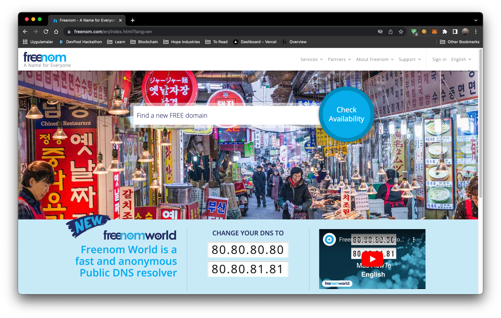
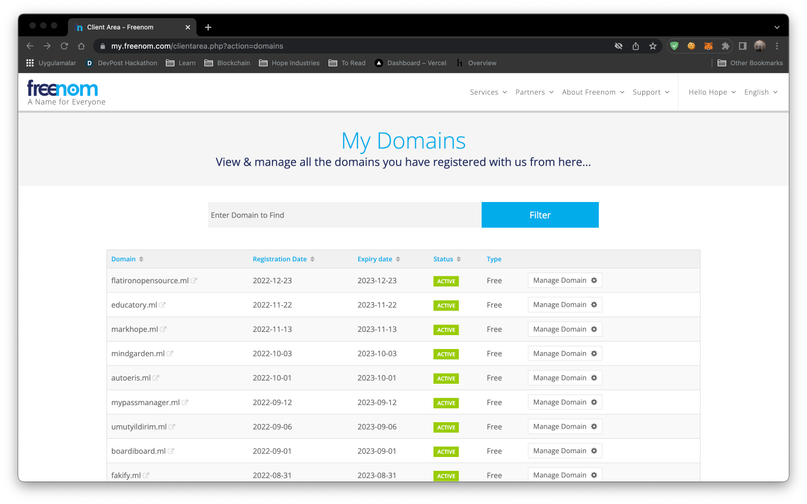
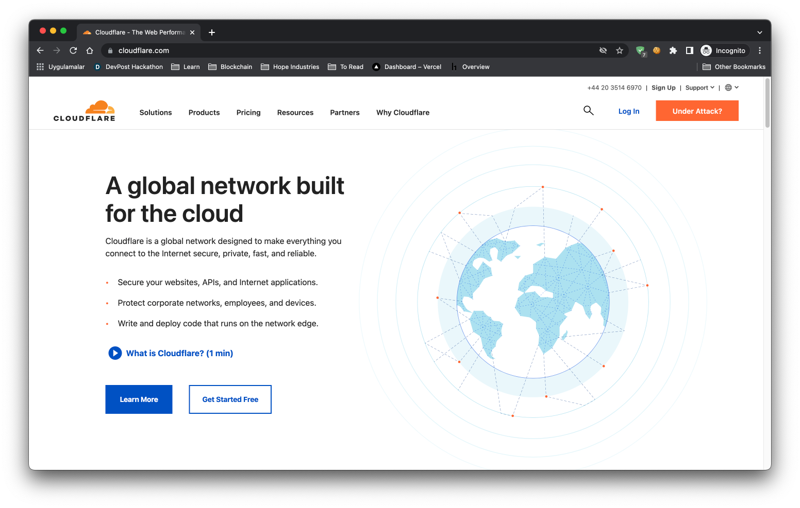
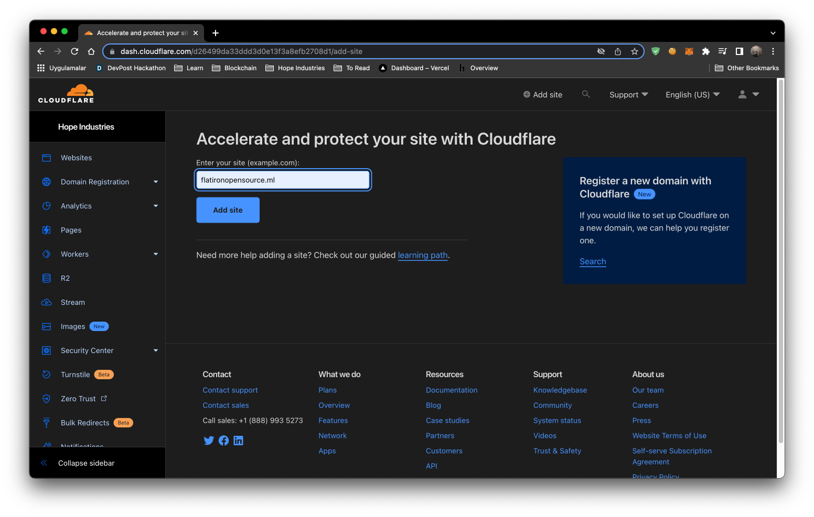
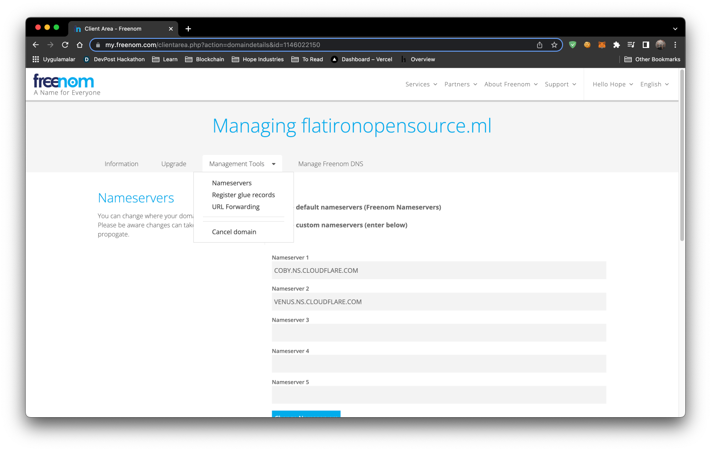
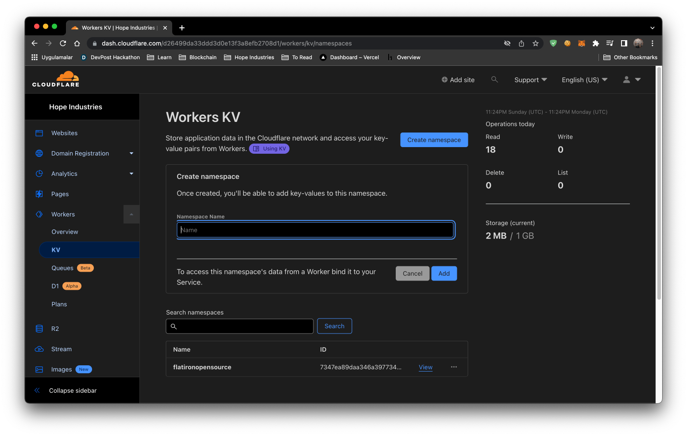
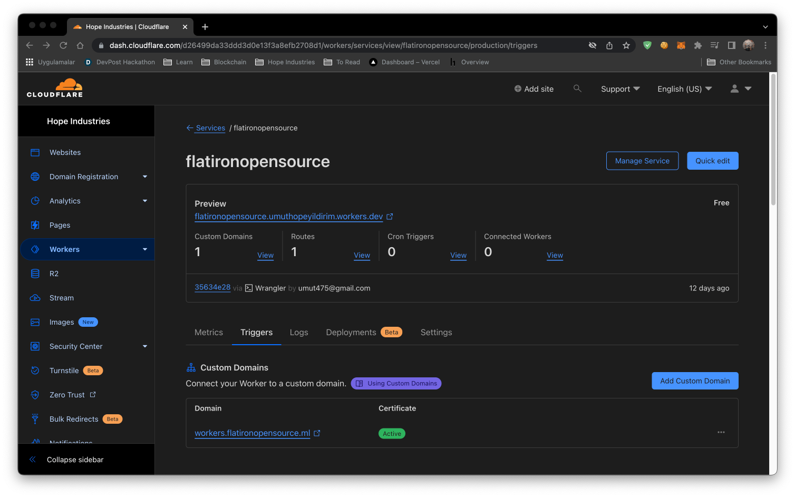

Welcome to part 2 of our Flatiron Open Source adventure, where we will talk about our backend setup. We fully utilized [Cloudflare](https://www.cloudflare.com/) in our project. We are going to explain this process step by step. 

## Step 1: Obtaining Free Domain
We are going to a obtain our free development domain by using a service called [Freenom](https://www.freenom.com/en/index.html?lang=en). 

Create an account and find an available domain. When you finish obtaining your domain proceed to [step 2](#step-2-creating-your-cloudflare-account).


## Step 2: Creating your Cloudflare Account
Cloudflare is a DNS(Domain Name Service). You can add your domain to Cloudflare and Cloudflare will protect you against bad actors and DOS attacks. Now let's create your account by clicking the **Sign Up** button in the top right of the webpage.

After registering to Cloudflare you will be redirected to dashboard. You will need to click the **Add Site** button at the top of the webpage and enter your Freenom domain from [step 1](#step-1-obtaining-free-domain). 

Once you add your domain you will be given 2 nameserver addresses. You need to access your Freenom dashboard and click the **Manage Domain** button. Once finished loading, click on **Managment Tools**, and then **Nameservers**.

You need to copy your Cloudflare nameservers and paste them into the Freenom nameserver textboxes, and then click the **Change Nameservers** button. 
Once you click the **update** button, the process can take up to 20 minutes to complete. Once Cloudflare finishes the setup, you will recieve an email congratulating you on setting up your first domain.

## Step 3: Cloudflare Pages Setup
Cloudflare Pages allows you to deploy your dynamic front-end applications. The platform is super fast, and is always up to date by deploying directly from your Git provider (this assumes you have a [github](https://github.com/) account).

You can also check their [documentation](https://developers.cloudflare.com/pages/).

1. Log in to the [Cloudflare dashboard](https://dash.cloudflare.com/).
2. Select your account in **Account Home** > **Pages**.
3. Select **Create a project** > **Connect to Git**.

### Configure your deployment
Once you have selected a Git repository, select **Install & Authorize** and **Begin setup**. You can then customize your deployment in **Set Up Builds And Deployments**.

Your project name will be used to generate your project’s hostname. By default, this matches your Git project name.

The production branch indicates the branch that Cloudflare Pages should use to deploy the production version of your site. For most projects, this is the main or master branch. 


Since we are using **Vite 3** we will follow **Vite 3** deployment for Cloudflare pages.

1. Log in to the [Cloudflare dashboard](https://dash.cloudflare.com/) and select your account.
2. Go to **Pages** > **Create a project** > **Connect to git**.
3. Select your new GitHub repository.
4. In the **Set up builds and deployments**, set `yarn build` as the **Build command**, and `dist` as the **Build output** directory.
5. Select **Environment variables (advanced)** > + Add variable > configure a `NODE_VERSION` variable with a value of any version of Node greater than `14.18` – this example uses `16`.

After completing configuration, select **Save and Deploy**,and wait for deployment to finish. After you have deployed your project, it will be available at the `<YOUR_PROJECT_NAME>.pages.dev` subdomain. After testing the website, you can add a custom domain to this website. This is becuase our domain is on Cloudflare, so we can easily add our domain to Cloudflare Pages. Click on `Custom Domains` and type your domain name. Cloudflare will automatically update your DNS record.

## Step 4: Cloudflare KV Setup
For backend work, Cloudflare has a plaform called Workers KV. Workers KV is a global, low-latency, key-value data store. It stores data in a small number of centralized data centers, then caches that data in Cloudflare’s data centers after access. 

KV supports exceptionally high read volumes with low latency, making it possible to build highly dynamic APIs and websites that respond as quickly as a cached static file would. There are some request limits and speed limits, that can be read about in the documentation [here](https://developers.cloudflare.com/workers/platform/limits/#kv-limits)
### Setup

Click on `Workers`, then `KV` on sidebar. Then click the **Create namespace** button and give your namespace name.
Finally, add a demo key and value to test functionality.

### Why We Used a Python Script for Backend Work
You might realize there is a [python script](https://github.com/umuthopeyildirim/FlatironOpenSource/blob/main/main.py) on our projects root. We created that script based on the content provided by Flatiron School upon graduation (as discussed in part 1 of the blog). When you run this script it will scrape through the Flatiron files, and create a formatted output file with the necessary key:value information for the project's backend. After running the script, the content was exported to Cloudflare KV.

## Step 5: Cloudflare Workers Setup
This is a simple worker that can be used to request data from Workers KV and send it to client side. It is very fast and can be used to serve static files.

### Setup
To setup the worker install the Cloudflare CLI (command line interface), called [wrangler](https://developers.cloudflare.com/workers/wrangler/),  as a global package
```bash
yarn global add @cloudflare/wrangler
```
or
```bash
npm install -g @cloudflare/wrangler
```
Then run
```bash
wrangler login
```
and follow the instructions.


### Usage
To use the worker you need to create a KV namespace and upload the files you want to serve.
Then you need to add the namespace id to the `wrangler.toml` file.
```javascript
kv-namespaces = [
    { binding = "your_binding_for_env", id = "your_namespace_id" }
]
```
Also change the account id with you account id in the `wrangler.toml` file.
```javascript
account_id = "your_account_id"
```
Then you can run
```bash
wrangler publish
```

You can find the source code [here](https://github.com/umuthopeyildirim/FlatironOpenSource/tree/main/workers).

We also gave a **custom domain** to this **Worker**. You can also give a **costum domain** to this worker like this image bellow.


## Step 6: Cloudflare R2 Setup
We are using Cloudflare R2 because **Product Design** is 
a resources intensive cohort. There is more than 250MB of data, which is why we decided to use R2 instead of uploading these resources on the **assets** folder of our Github. We also gave our R2 a **custom domain** so we can access it on our website.
This [documentation](https://developers.cloudflare.com/r2/data-access/public-buckets/) explains how to add a custom domain on your R2.

## Conclusion
Cloudflare is a popular choice for SaaS companies due to its wide range of free and inexpensive services. Its user-friendly documentation and abundance of resources make it an especially appealing option for new full stack engineers. I highly recommend considering Cloudflare for your project.

If you encounter any issues, it is always a good idea to try searching for a solution online. Google is a great place to start. If you are unable to find a solution through a Google search, you can also try visiting Cloudflare's community page for additional help and support.
curl $REPLIT_DB_URL/key

Thank you for reading our blog post and don't forget to check our last part of [Flatiron Open Source](https://flatironopensource.ml/).