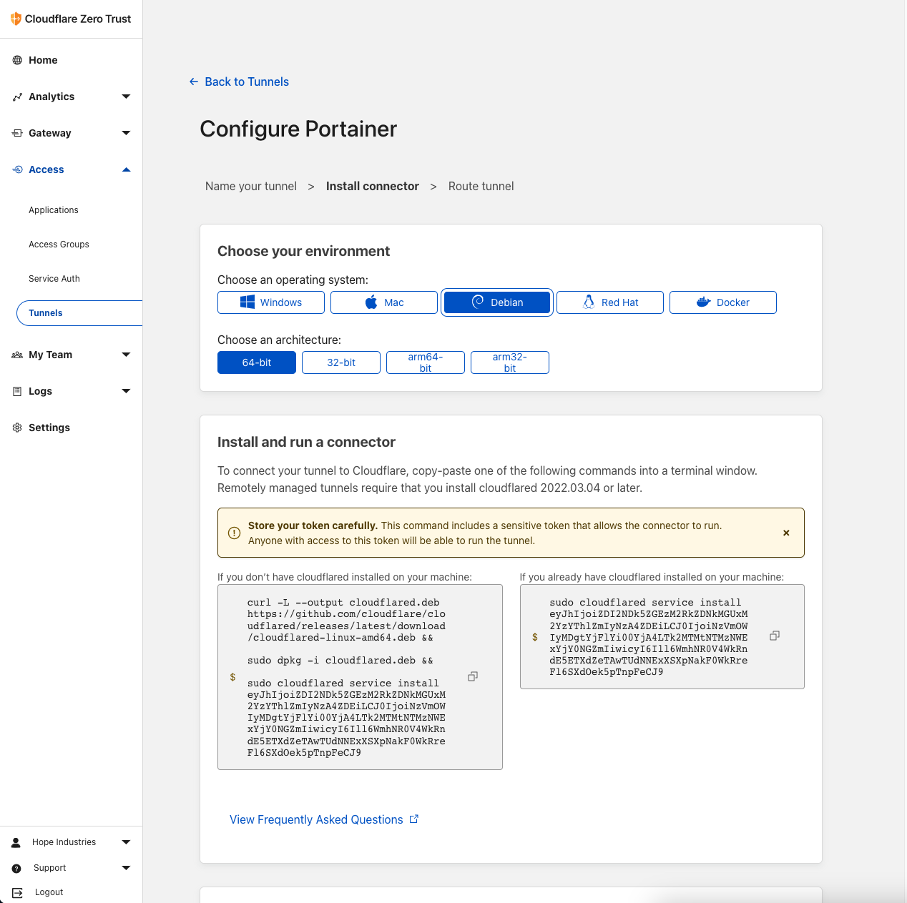
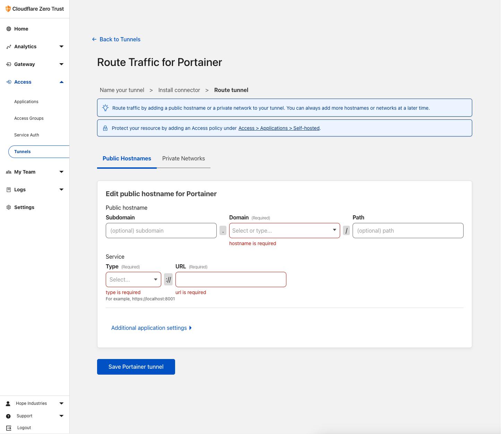

Raspberry Pi, come out of the closet! It's time for you to shine! I'll show you how I give my Pi a good workout and I'll teach you how to do the same in this post. Let's get physical (with technology)!

<!-- truncate -->

## Cloudflare Tunnel (Optional)

Cloudflare Tunnel allows you to access your Raspberry Pi without publicly available IP address. So let's SSH to our Pi and install `cloudflared`.

You don't need to do this! But I highly suggest using Cloudflare Tunnel this will make your Raspberry Pi available to internet so you can access your Pi via internet.

### Install Required Softwares

1. Our first task is to perform an update of the package list as well as upgrade any out-of-date packages. You can perform both of these tasks using the following command in the terminal.

```bash
sudo apt update
sudo apt upgrade
```

2. Once the update completes, we must ensure we have both the “`curl`” and “`lsb-release`” packages. Install both of these packages by using the command below in the terminal.

```bash
sudo apt install curl lsb-release
```

3. With all the required packages in place, we can finally grab the GPG key for the Cloudflared repository and store it on our Raspberry Pi. A GPG key is crucial to verify the packages we are installing are valid and belong to the repository.

```bash
curl -L https://pkg.cloudflare.com/cloudflare-main.gpg | sudo tee /usr/share/keyrings/cloudflare-archive-keyring.gpg >/dev/null
```

4. With the GPG key saved into our keyrings folder, our next step is to add the Cloudflared repository to our Raspberry Pi. You can add

```bash
echo "deb [signed-by=/usr/share/keyrings/cloudflare-archive-keyring.gpg] https://pkg.cloudflare.com/cloudflared $(lsb_release -cs) main" | sudo tee  /etc/apt/sources.list.d/cloudflared.list
```

5. As we have made changes to the available repositories, we will need to perform another update of the package list cache. You can update this cache by using the following command within the terminal.

```bash
sudo apt update
```

### Installing `Cloudfared` and setting up Tunnel to the Raspberry Pi

With the repository added, we can now proceed to install the Cloudflared package to our Raspberry Pi.

To install this package, you will want to run the following command.

```bash
sudo apt install cloudflared
```

Now that we have prepared our Raspberry Pi, we can set up the Cloudflare tunnel. Now let's go to [Cloudflare Zero Trust](https://one.dash.cloudflare.com/) dashboard and navigate to Access-> Tunnels then click on `Create a tunnel`. Name our tunnel to something meaningful. Cloudflare will create a new tunnel and will show you instructions on the page.



Since we already installed `cloudflared` you need to copy the text on the right and paste it on SSH. Cloudflare dashboard will show `Connectors` at the bottom of setup page. Once your Raspberry Pi finish the code you pasted you will see your device there then you can continue your setup. You will see this page



So let's make our ssh browser based. Follow these instructions;

- Subdomain: `ssh`
- Domain: Your choice you can get free domain via Freenom.
- Path: Empty
- Type: `SSH`
- URL: `localhost:22` And SAVE! Congratulations, you have successfully created your Cloudflare Tunnel. Now add this this tunnel to Applications and your are good to go!

## Docker

Let's install Docker on our Raspberry Pi. Docker is a containerization platform that allows you to run applications in isolated containers. This is a great way to run applications on your Raspberry Pi without having to worry about dependencies and other issues that can arise when running multiple applications on the same device.

### Install Required Softwares

1. Our first task is to perform an update of the package list as well as upgrade any out-of-date packages. You can perform both of these tasks using the following command in the terminal.

```bash
sudo apt update
sudo apt upgrade
```

2. With our Raspberry Pi entirely up to date, we can now go ahead and install Docker to the Raspberry Pi.

Luckily for us, Docker has made this process incredibly quick and straightforward by providing a bash script that installs everything for you.

You can download and run the official Docker setup script by running the following command.

```bash
curl -sSL https://get.docker.com | sh
```

This command will pipe the script directly into the command line. Typically it would be best if you didn’t do this; however, Docker is a trusted source.

### Setting up the Pi user for Docker

We need to make a slight adjustment to our `pi` user before we can start using Docker without issues. This is to do with the way that the Linux permission system works with Docker.

1. Once Docker has finished installing to the Pi, there are a couple more things we need to do. For another user to be able to interact with Docker, it needs to be added to the `docker` group. So our next step is to add our `pi` user to the `docker` group by using the command below.

```bash
sudo usermod -aG docker pi
```

2. With the `pi` user added to the `docker` group, we can now log out of the Raspberry Pi and log back in again. This will ensure that the changes we have made to the `pi` user are applied.

```bash
logout
```

3. Once you have logged back in, you can verify that the `pi` user has been added to the `docker` group by running the following command.

```bash
groups
```

You should see the `docker` group listed in the output. If you do not see the `docker` group listed, you will need to log out and log back in again. Once you have verified that the `pi` user has been added to the `docker` group, we can move on to the next step.

## Increasing the Swap File Size

The Raspberry Pi is a great little device, but it does have one major drawback. It only has a small amount of RAM. This can be a problem when running Docker containers as they can use a lot of RAM. To get around this, we can increase the size of the swap file.

1. Before we can increase our Raspberry Pi’s swap file, we must first temporarily stop it. The swap file cannot be in use while we increase it. To stop the operating system from using the current swap file, run the following command.

```bash
sudo dphys-swapfile swapoff
```

2. With the swap file stopped, we can now increase the size of the swap file. To do this, we will need to edit the `/etc/dphys-swapfile` file. You can edit this file by running the following command.

```bash
sudo nano /etc/dphys-swapfile
```

3. Once the file has opened, we need to change the value of the `CONF_SWAPSIZE` variable. This variable controls the size of the swap file. By default, this value is set to 100. We need to increase this value to 200. You can do this by changing the value of the `CONF_SWAPSIZE` variable to 200.

```bash
CONF_SWAPSIZE=200
```

4. Once you have made the change, you can save the file by pressing `CTRL+X` and then `Y` to confirm the save. You can then exit the editor by pressing `ENTER`.

5. We can now re-initialize the Raspberry Pi’s swap file by running the command below. Running this command will delete the original swap file and recreate it to fit the newly defined size.

```bash
sudo dphys-swapfile setup
```

6. With the swap file re-initialized, we can now start it again by running the following command.

```bash
sudo dphys-swapfile swapon
```

7. If you want all programs to be reloaded with access to the new memory pool, then the easiest way is to restart your device.

```bash
sudo reboot
```

## Now what?

You can use Docker to run any application that you want. You can even run multiple applications at the same time. So here is a list of applications I use on my Raspberry Pi.

### Bitwarden

Bitwarden is a free and open-source password manager that allows you to store all of your passwords in one secure location. This is a great way to keep all of your passwords safe and secure.

Here is a guide on how to install Bitwarden on your Raspberry Pi.

1. Install Bitwarden image using CLI.

```bash
docker pull vaultwarden/server:latest
```

2. Once Docker finishes downloaded Bitwarden RS to your Raspberry Pi, you can now continue.

```bash
sudo docker run -d --name bitwarden \
    --restart=always \
    -v /bw-data/:/data/ \
    -p 127.0.0.1:9999:80 \
    -p 127.0.0.1:3012:3012 \
    vaultwarden/server:latest
```

### Uptime Kuma

Uptime Kuma is a free and open-source uptime monitoring tool that allows you to monitor the status of your websites and services. This is a great way to keep track of the status of your websites and services.

Here is a guide on how to install Uptime Kuma on your Raspberry Pi.

1. Install Uptime Kuma image using CLI.

```bash
docker pull louislam/uptime-kuma
```

2. Create a volume for Uptime Kuma.

```bash
docker volume create uptime-kuma
```

3. Start the Uptime Kuma container.

```bash
docker run -d --name uptime-kuma \
    --restart=always \
    -p 9998:3001 \
    -v uptime-kuma:/app/data \
    louislam/uptime-kuma
```

### Netdata

Netdata is a free and open-source real-time performance monitoring tool that allows you to monitor the performance of your Raspberry Pi. This is a great way to keep track of the performance of your Raspberry Pi.

Here is a guide on how to install Netdata on your Raspberry Pi.

1. Install Netdata image using CLI.

```bash
docker pull netdata/netdata
```

2. Start the Netdata container.

```bash
docker run -d --name netdata \
    --restart=always \
    -p 9997:19999 \
    -v netdataconfig:/etc/netdata \
    -v netdatalib:/var/lib/netdata \
    -v netdatacache:/var/cache/netdata \
    -v /proc:/host/proc:ro \
    -v /sys:/host/sys:ro \
    -v /etc/os-release:/host/etc/os-release:ro \
    --cap-add SYS_PTRACE \
    --security-opt apparmor=unconfined \
    netdata/netdata
```

## Conclusion

Thank you for reading this guide. If you found this guide useful, please consider sharing it with your friends and family.
