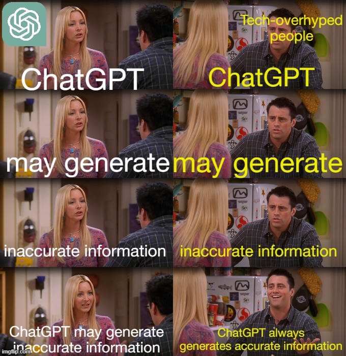
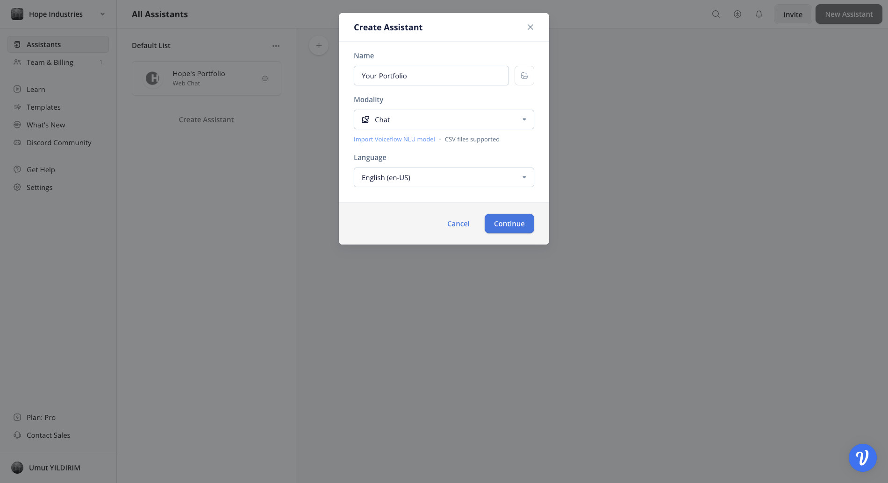
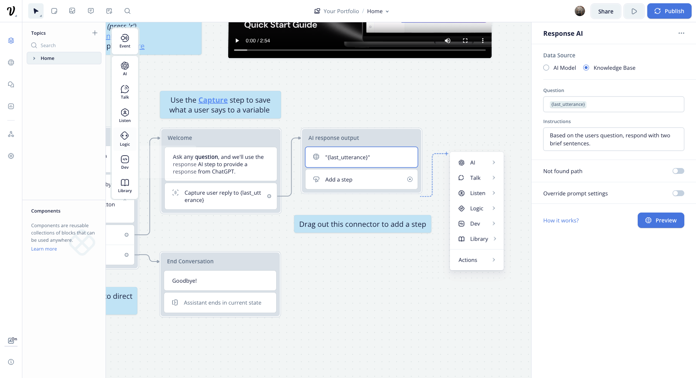
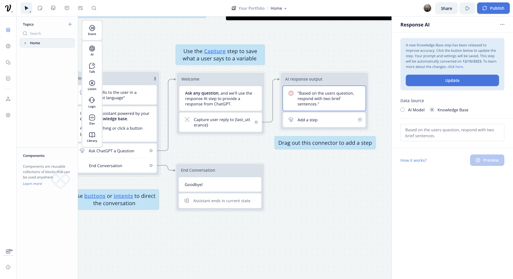
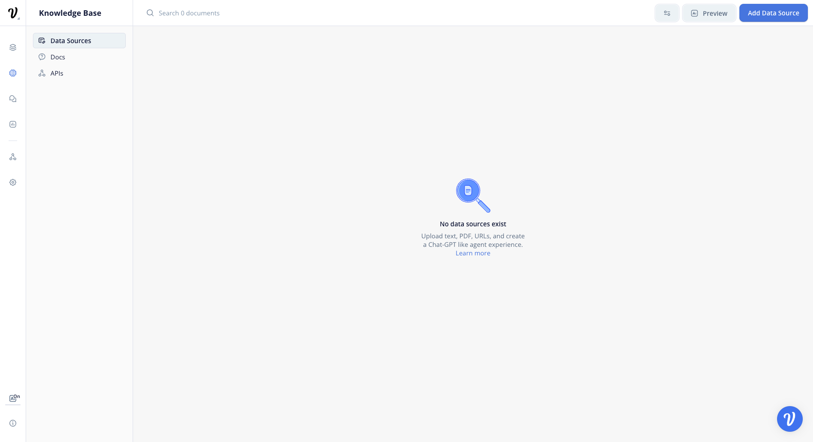
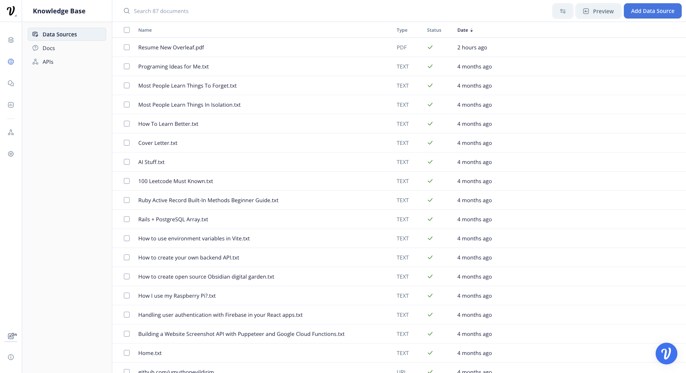
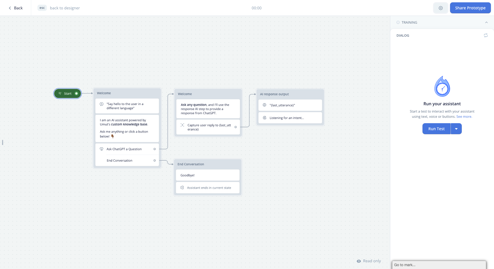
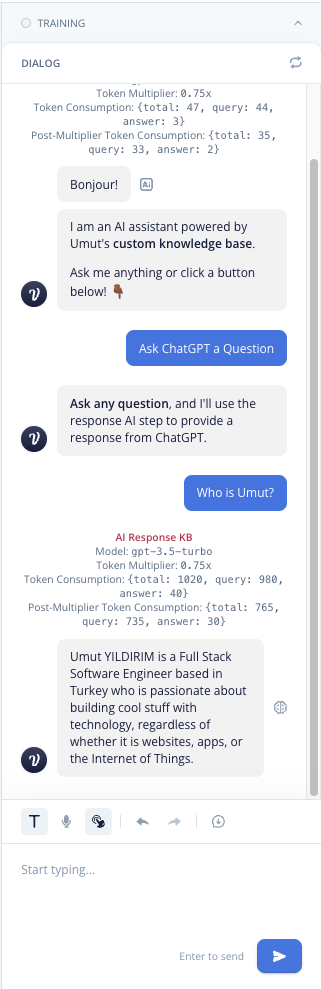
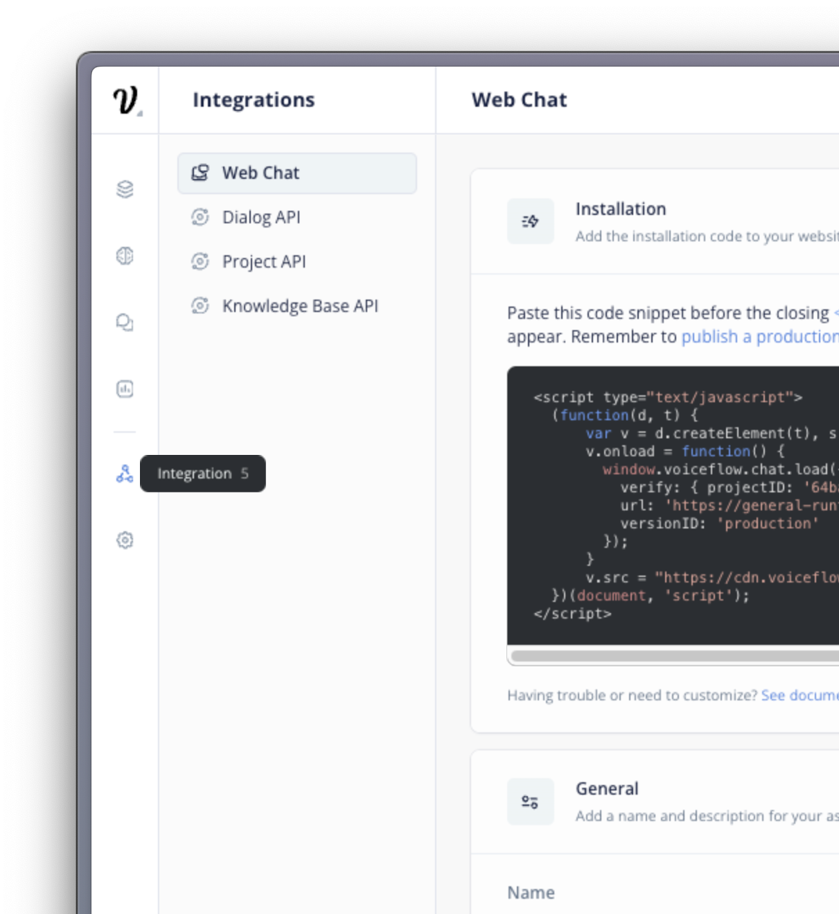
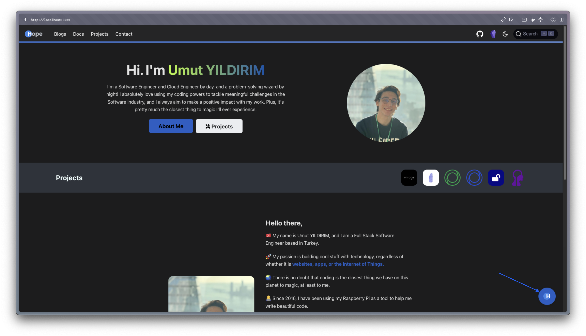

ChatGPT and similar large language models (LLMs) are currently at the forefront of every developer's mind, emerging as the latest trend in 'Silicon Valley'. The hype is real, and the possibilities are endless. But how do you get started? In this article, I will show you how to create a simple chatbot using ChatGPT and Voiceflow. I will also show you how to add it to your portfolio using Docusaurus.

## Let's understand the basics first

Before delving into the creation of a ChatGPT-based chatbot, it's essential to grasp the fundamental principles underlying ChatGPT. Developed by OpenAI, ChatGPT stands as a prominent example of a large language model (LLM), distinguished by its proficiency in producing text that closely resembles human writing. This capability stems from its design as a transformer model, a type of architecture that has significantly advanced the field of natural language processing (NLP).


The core strength of ChatGPT lies in its extensive training on a diverse array of text sources. This comprehensive dataset equips the model with a broad understanding, enabling it to engage in and respond to a wide spectrum of topics with a natural, conversational tone.



However, the reliance on pre-existing data also introduces a limitation. ChatGPT's knowledge is confined to its training material, meaning it lacks the ability to generate information beyond its training scope. This is where innovative technologies like Retrieval-Augmented Generation (RAG) play a pivotal role. RAG merges the transformer model's capabilities with a search engine's prowess. This combination allows ChatGPT to not only generate responses based on its internal knowledge but also to pull in and utilize relevant, up-to-date information from external sources, such as the internet or specialized vector databases. This enhancement significantly broadens the model's applicability and accuracy, making it a more dynamic tool in the realm of NLP.


## Let's build a chatbot

Now that we have a basic understanding of ChatGPT, let's build a chatbot using Voiceflow. Voiceflow is a no-code platform that allows you to create voice and chat-based applications. It is a great tool for beginners and experienced developers alike, as it provides a simple, intuitive interface that enables you to build a functional chatbot in a matter of minutes. It also offers 'Knowledge Base' integration, which is essential for our chatbot project.

### Create a new assistant

First, create a new assistant by clicking on the 'Create Assistant' button on the top right corner of the screen. Then, name your chatbot and select the 'Chat' option and don't forget to select your preferred language. Finally, click on the 'Create Assistant' button to create your assistant.




Congratulations! You have successfully created your first assistant. Now, let's move on to the next step and add some knowledge to your assistant.

### Change response type to 'Knowledge Base'

Since we want a chatbot that anwsers questions based on your personal knowledge base, we need to change the response type to 'Knowledge Base'. To do that, click on the first block on 'AI response output' and select the 'Knowledge Base' option. Finally, click on the 'Save' button to save your changes.



:::info[Update]

Voiceflow has changed the way your knowledge base is used. Instead of [Retrieval](https://python.langchain.com/docs/modules/data_connection/) method they are now using [Agents](https://python.langchain.com/docs/modules/agents/) to grap relavent information from your knowledge base. This is a great improvement and makes your chatbot more accurate.

:::



Well now your chatbot is ready to answer questions but it doesn't have any knowledge yet. Let's add some knowledge to your assistant.

### Add knowledge to your assistant

To add knowledge to your assistant you need to prepare text, PDF, DOCX or your existing website. After that, you need to upload it to Voiceflow. Once you have uploaded your knowledge, you can start adding it to your assistant.



To do that, click on the 'Add Knowledge' button on the top right corner of the screen. Then, select the 'Upload' option and upload your knowledge. Finally, click on the 'Add Knowledge' button to add your knowledge to your assistant.



Congratulations! You have successfully added knowledge to your assistant. Now, let's move on to the next step and test your assistant.

### Test your assistant

WOW in less then 10 minutes you have created your first chatbot. Now, let's test your assistant. To do that, click on the 'Run' button on the top right corner of the screen or simply press 'R' button on your keyboard. Then, click on the 'Run Test' button to start testing your assistant.



Let's start asking some easy questions. For example, ask your chatbot 'Who is _your name_?' or 'What is _your name_'s current employer?'. If you have added your personal information to your knowledge base, your chatbot should be able to answer your questions.



If you don't see any answers you are either missing some information in your knowledge base or you have not added your knowledge base to your assistant. If you have added your knowledge base to your assistant, you can check if you have added your knowledge base to your assistant by clicking on the 'Knowledge Base' button on the top right corner of the screen.

### Add your chatbot to your portfolio

If your portfolio is HTML based, you can add your chatbot to your portfolio by adding the following code to your HTML file.

```html
<script type="text/javascript">
  (function (d, t) {
    var v = d.createElement(t),
      s = d.getElementsByTagName(t)[0];
    v.onload = function () {
      window.voiceflow.chat.load({
        verify: {projectID: 'your project id'},
        url: 'https://general-runtime.voiceflow.com',
        versionID: 'production',
      });
    };
    v.src = 'https://cdn.voiceflow.com/widget/bundle.mjs';
    v.type = 'text/javascript';
    s.parentNode.insertBefore(v, s);
  })(document, 'script');
</script>
```

You can also costumize your chatbot by checking out integrations tab on Voiceflow.



### Add your chatbot to your Docuaurus portfolio

If your portfolio is based on Docuaurus, you can add your chatbot to your portfolio by following these steps.

Create a new file called `voiceflow.js` in your `src/theme` folder and add the following code to it.

```javascript
import ExecutionEnvironment from '@docusaurus/ExecutionEnvironment';

if (ExecutionEnvironment.canUseDOM) {
  (function (d, t) {
    var v = d.createElement(t),
      s = d.getElementsByTagName(t)[0];
    v.onload = function () {
      window.voiceflow.chat.load({
        verify: {projectID: '64bad5417ef5eb00077b0c2d'},
        url: 'https://general-runtime.voiceflow.com',
        versionID: 'production',
      });
    };
    v.src = 'https://cdn.voiceflow.com/widget/bundle.mjs';
    v.type = 'text/javascript';
    s.parentNode.insertBefore(v, s);
  })(document, 'script');
}
```

Then, add the following code to your `docusaurus.config.js` file.

```javascript
  clientModules: [require.resolve('./src/theme/voiceflow.js')],
```

and you are done. Now, you can start your local server by running `yarn start` and test your chatbot.



## Conclusion

This guide demonstrated how to enhance your tech portfolio by integrating ChatGPT into a chatbot project, using Voiceflow and Docusaurus. It's a testament to the ease of using advanced AI in modern web development, showcasing your skills in navigating emerging technologies. This project is not just a technical achievement, but a step towards future innovations in AI. Keep exploring and embracing new tech frontiers!
