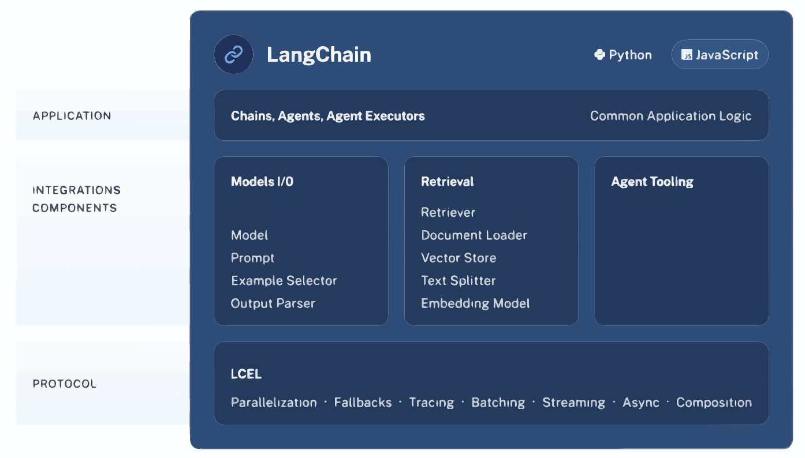
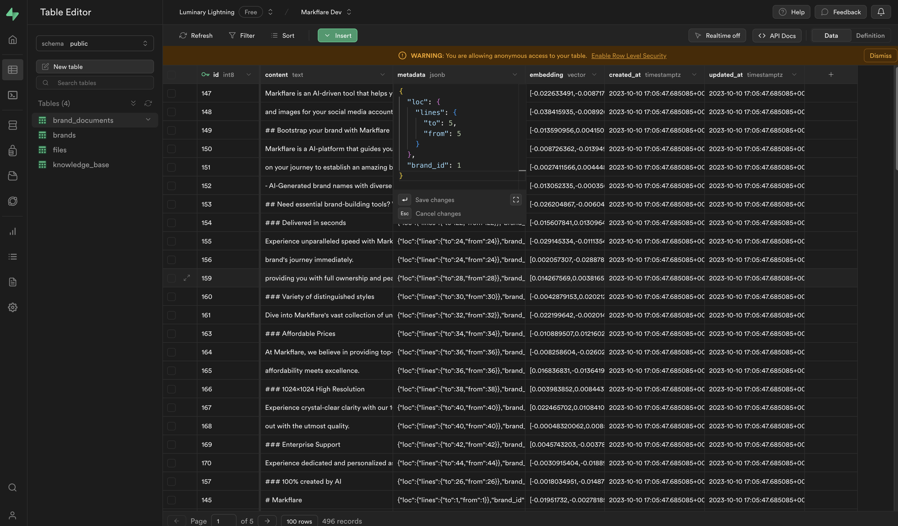

Supabase, acclaimed as an open-source alternative to Firebase, offers a comprehensive toolkit including database, authentication, and storage solutions. Excelling in crafting Minimum Viable Products (MVPs) and hackathon creations, it's particularly adept for building RAG (Retrieval-Augmented Generation) applications. In this guide, I'll demonstrate how to leverage Supabase to enhance your RAG application's efficiency.

Here's the workflow: Whenever a user uploads a document, we store its vector representation in Supabase. This vector acts as a unique fingerprint of the document's content. Later, when a query is raised, Supabase springs into action, searching for vectors that closely match the query. This search process efficiently retrieves the most relevant documents.

<!-- truncate -->

An added layer of personalization ensures that users interact only with their content. We implement a filter to display documents created by the user, providing a tailored and secure user experience. This approach not only streamlines the search for relevant information but also maintains user data privacy and relevance.

If you want to see the final product, check out the [demo](https://markai.umutyildirim.com/). The source code is available on [GitHub](https://github.com/umuthopeyildirim/markai). We will build this application from scratch in another tutorial. However, for now, let's focus on the Supabase vector filtering.

:::info

In this tutorial, we'll use the [Langchain JavaScript Client](https://js.langchain.com/docs/get_started/introduction) to interact with the database. All of the examples are written in JavaScript.

:::

## How Langchain Works?

**LangChain** is a framework for developing applications powered by language models. It enables applications that:

- **Are context-aware**: connect a language model to sources of context (prompt instructions, few shot examples, content to ground its response in, etc.)
- **Reason**: rely on a language model to reason (about how to answer based on provided context, what actions to take, etc.)



## How to setup database?

In this tutorial we will mainly focus on Supabase PostgreSQL database. You can use any other database as well. However, you need to make sure that your database supports vector filtering. You can check the [Langchain documentation](https://python.langchain.com/docs/integrations/vectorstores/) for more information.

Start by creating a new project on [Supabase](https://supabase.io/). You can use the free plan for this tutorial. After creating your project, navigate to **SQL Editor** and create a new table called `documents`. You can use the following SQL query to create the table.

```sql
-- Enable the pgvector extension to work with embedding vectors
create extension vector;

-- Create a table to store your documents
create table documents (
  id bigserial primary key,
  content text, -- corresponds to Document.pageContent
  metadata jsonb, -- corresponds to Document.metadata
  embedding vector(1536) -- 1536 works for OpenAI embeddings, change if needed
);

-- Create a function to search for documents
create function match_documents (
  query_embedding vector(1536),
  match_count int DEFAULT null,
  filter jsonb DEFAULT '{}'
) returns table (
  id bigint,
  content text,
  metadata jsonb,
  embedding jsonb,
  similarity float
)
language plpgsql
as $$
#variable_conflict use_column
begin
  return query
  select
    id,
    content,
    metadata,
    (embedding::text)::jsonb as embedding,
    1 - (documents.embedding <=> query_embedding) as similarity
  from documents
  where metadata @> filter
  order by documents.embedding <=> query_embedding
  limit match_count;
end;
$$;
```

First step is done 🎉.

## How to add data to database?

Now that we have our database ready, we can start adding data to it. Since we need to get relevant data for our queries, we need to add relevant metadata to our documents. Your SQL row should look like this;



Did you catch the `brandId` field? We will use this field to filter the documents. We will only show the documents that are created by the user. This way, we can provide a personalized experience to our users.

But how do we do that in our application? Let's take a look at the code. Keep in mind I'm using Next.js for this tutorial. You can use any other framework as well.

```js
import { NextRequest, NextResponse } from "next/server";
import { RecursiveCharacterTextSplitter, CharacterTextSplitter } from "langchain/text_splitter";

import { createClient } from "@supabase/supabase-js";
import { SupabaseVectorStore } from "langchain/vectorstores/supabase";
import { OpenAIEmbeddings } from "langchain/embeddings/openai";
import { auth } from '@clerk/nextjs';

export const runtime = "edge";

async function handleExtension(extension: string, content: string, brand_id: string, client: any) {
  let splitter;

  if (extension === "txt") {
    splitter = new CharacterTextSplitter({
      separator: " ",
      chunkSize: 256,
      chunkOverlap: 20,
    });
  } else {
    const language = extension === "md" ? "markdown" : "html";
    splitter = RecursiveCharacterTextSplitter.fromLanguage(language, {
      chunkSize: 256,
      chunkOverlap: 20,
    });
  }

  const splitDocuments = await splitter.createDocuments(
    [content],
    [{ brand_id: brand_id }],
  );

  const vectorstore = await SupabaseVectorStore.fromDocuments(
    splitDocuments,
    new OpenAIEmbeddings(
      {
        openAIApiKey: process.env.NEXT_SECRET_OPENAI_API_KEY!,
        configuration: {
          baseURL: "https://gateway.ai.cloudflare.com/v1/********/********/openai",
        },
      }
    ),
    {
      client,
      tableName: "documents",
      queryName: "match_documents",
    }
  );
}

export async function POST(req: NextRequest) {
  const { userId, getToken } = auth();
  if(!userId){
    return NextResponse.json({ error: "Not logged in." }, { status: 403 });
  }
  const token = await getToken({template: "supabase"});
  const body = await req.json();
  const {name, content, brand_id, knowledge_id} = body;

  // Get file extension
  const extension = name.split(".").pop();

  // Accept these file types
  // Markdown, Text, HTML
  if (!["md", "txt", "html"].includes(extension)) {
    return NextResponse.json(
      {
        error: [
          "File type not supported.",
          "Please upload a markdown, text, or html file.",
        ].join("\n"),
      },
      { status: 403 },
    );
  }

  try {
    const client = createClient(
      process.env.NEXT_PUBLIC_SUPABASE_URL!,
      process.env.NEXT_PUBLIC_SUPABASE_KEY!,
      {
        global: {
          headers: {
            "Authorization": `Bearer ${token}`,
          },
        }
      }
    );

    await handleExtension(extension, content, brand_id, client);
    return NextResponse.json({ ok: true }, { status: 200 });
  } catch (e: any) {
    return NextResponse.json({ error: e.message }, { status: 500 });
  }
}
```

Now step by step analyze the code using pseudo code.

1. When user adds a new document, it calls a POST API endpoint. We call it `/api/ingest/` in our application.
2. Ingest API endpoint gets the user's token from Clerk and `userId` user sent when they called the request.
3. We make sure that the user is logged in. If not, we return an error.
4. We get the file extension from the file name. We only accept `md`, `txt`, and `html` files. So we make sure that the file extension is one of them. If not, we return an error.
5. We create a new Supabase client using the token we got from Clerk.
6. We call the `handleExtension` function with the file extension, content, brand_id, and client(supabase).
7. We split the content into chunks and create documents using the `CharacterTextSplitter` class.
8. We add `brand_id` to the metadata of the document. This way, we can filter the documents later.
9. We call the `SupabaseVectorStore.fromDocuments` function to add the documents to the database. This function will add the vector representation of the document to the database.
10. We return a success message to the user.

We split our data into chunks because we need to make sure that the vector representation of the document is not too big. If it's too big, it will make our KNN search more harder. So we split the document into chunks and store the vector representation of each chunk in the database. After that we converted content to vector representation using OpenAI Embeddings. You can use any other embedding as well. You can check the [Langchain documentation](https://api.js.langchain.com/classes/embeddings_base.Embeddings.html) for more information.

You might realized that we are using `brand_id` instead of `user_id`. This is because we want to make sure that the other users can see files and embeddings created by other users in same organization. If you want to make sure that users can only see their own files, you can use `user_id` instead of `brand_id`. You can also use both of them if you want to.

## How to query the database?

Now that we have some context in our database we can start querying it to get relevant data. While Langchain requests this data from the database, all searching and filtering is done on Supabase side using PostgreSQL functions. Now let's take a look at the code and then analyze it.

:::info

In this example I used Agent's API to query the database. This will allow GPT4 to decide what to search for. You can also use retrieval to force context search but I don't recomend it since it will make your database slower.

:::

```js
import { NextRequest, NextResponse } from "next/server";
import { Message as VercelChatMessage, StreamingTextResponse } from "ai";

import { createClient } from "@supabase/supabase-js";

import { ChatOpenAI } from "langchain/chat_models/openai";
import { SupabaseVectorStore } from "langchain/vectorstores/supabase";
import { AIMessage, ChatMessage, HumanMessage } from "langchain/schema";
import { OpenAIEmbeddings } from "langchain/embeddings/openai";
import {
  createRetrieverTool,
  OpenAIAgentTokenBufferMemory,
} from "langchain/agents/toolkits";
import { ChatMessageHistory } from "langchain/memory";
import { initializeAgentExecutorWithOptions } from "langchain/agents";

export const runtime = "edge";

const convertVercelMessageToLangChainMessage = (message: VercelChatMessage) => {
  if (message.role === "user") {
    return new HumanMessage(message.content);
  } else if (message.role === "assistant") {
    return new AIMessage(message.content);
  } else {
    return new ChatMessage(message.content, message.role);
  }
};

const TEMPLATE = `You are an helpful assistant named "MarkAI". If you don't know how to answer a question, use the available tools to look up relevant information.`;

export async function POST(req: NextRequest) {
  try {
    const body = await req.json();
    const brand_id = body.brand_id;
    // Check brand id for validation
    if (!brand_id) {
      return NextResponse.json({ error: "brand_id is either empty or wrong." }, { status: 400 });
    }
    const messages = (body.messages ?? []).filter(
      (message: VercelChatMessage) =>
        message.role === "user" || message.role === "assistant",
    );
    const returnIntermediateSteps = body.show_intermediate_steps;
    const previousMessages = messages.slice(0, -1);
    const currentMessageContent = messages[messages.length - 1].content;

    const model = new ChatOpenAI({
      openAIApiKey: process.env.NEXT_SECRET_OPENAI_API_KEY!,
      modelName: "gpt-3.5-turbo",
      // This was used so I could track usage of the model in Cloudflare Dashboard
      // for more info: https://developers.cloudflare.com/ai-gateway/
      configuration: {
        baseURL: "https://gateway.ai.cloudflare.com/v1/**************/*******/openai",
      },
    });

    const client = createClient(
      process.env.NEXT_PUBLIC_SUPABASE_URL!,
      process.env.NEXT_PUBLIC_SUPABASE_KEY!,
    );
    const vectorstore = new SupabaseVectorStore(new OpenAIEmbeddings(
      {
      openAIApiKey: process.env.NEXT_SECRET_OPENAI_API_KEY!,
    }
    ), {
      client,
      tableName: "documents",
      queryName: "match_documents",
      filter:{
        "brand_id": brand_id
      }
    });

    const chatHistory = new ChatMessageHistory(
      previousMessages.map(convertVercelMessageToLangChainMessage),
    );

    const memory = new OpenAIAgentTokenBufferMemory({
      llm: model,
      memoryKey: "chat_history",
      outputKey: "output",
      chatHistory,
    });

    const retriever = vectorstore.asRetriever();

    const tool = createRetrieverTool(retriever, {
      name: "search_latest_knowledge",
      description: "Searches and returns up-to-date general information.",
    });

    const executor = await initializeAgentExecutorWithOptions([tool], model, {
      agentType: "openai-functions",
      memory,
      returnIntermediateSteps: true,
      verbose: true,
      agentArgs: {
        prefix: TEMPLATE,
      },
    });

    const result = await executor.call({
      input: currentMessageContent,
    });

    if (returnIntermediateSteps) {
      return NextResponse.json(
        { output: result.output, intermediate_steps: result.intermediateSteps },
        { status: 200 },
      );
    } else {
      // Agent executors don't support streaming responses (yet!), so stream back the complete response one
      // character at a time to simluate it.
      const textEncoder = new TextEncoder();
      const fakeStream = new ReadableStream({
        async start(controller) {
          for (const character of result.output) {
            controller.enqueue(textEncoder.encode(character));
            await new Promise((resolve) => setTimeout(resolve, 20));
          }
          controller.close();
        },
      });

      return new StreamingTextResponse(fakeStream);
    }
  } catch (e: any) {
    return NextResponse.json({ error: e.message }, { status: 500 });
  }
}
```

Now step by step analyze the code using pseudo code;

1. **Import Dependencies:** Import necessary modules from Next.js, ai, @supabase/supabase-js, and langchain.

2. **Declare Runtime Environment:** Define `runtime` as "edge," indicating the environment where the code will run.

3. **Convert Function:** `convertVercelMessageToLangChainMessage` converts messages from VercelChatMessage format to LangChain's message format based on the role (user, assistant, or other).

4. **Define Assistant Template:** Set `TEMPLATE` as a prompt for the AI assistant.

5. **POST Function:**
   - **Initialize:** Define an asynchronous `POST` function for handling HTTP POST requests.
   - **Parse Request Body:** Extract `brand_id` and `messages` from the request body.
   - **Validate Brand ID:** Return an error response if `brand_id` is missing or invalid.
   - **Filter Messages:** Only keep messages from users or assistants.
   - **Extract Content:** Get the content of the current message and previous messages.
   - **Setup AI Model:** Initialize `ChatOpenAI` with GPT-3.5 model and configuration for Cloudflare AI Gateway.
   - **Supabase Client:** Create a Supabase client for database interactions.
   - **Vector Store:** Initialize `SupabaseVectorStore` with OpenAI embeddings, Supabase client, and table configuration.
   - **Chat History:** Create a chat history object from previous messages.
   - **Memory:** Setup `OpenAIAgentTokenBufferMemory` using the model and chat history.
   - **Retriever Tool:** Initialize a retriever tool for fetching up-to-date information.
   - **Executor:** Prepare `executor` with tools, model, memory, and other configurations.
   - **Execute AI Model:** Call the executor with the current message and capture the result.
   - **Return Response:** If `returnIntermediateSteps` is true, return output and intermediate steps; otherwise, stream the response character by character.
   - **Error Handling:** Catch and return errors in a JSON response.

6. **Runtime Configuration:** The code configures and executes in an edge environment, suitable for high-performance and low-latency applications.

The code essentially sets up a sophisticated chatbot that can handle user queries by integrating various AI and database technologies. It supports real-time interactions and can provide detailed responses, including intermediate steps of the AI's reasoning process.

## Conclusion

I trust this guide clarified the process of integrating Supabase vector filtering with Langchain, a challenge that took me two days to overcome. My aim is to simplify your experience. Should you have inquiries, please don't hesitate to contact me at hope@umutyildirim.com or raise an issue on the GitHub repository of my demo app [here](https://github.com/umuthopeyildirim/markai).
