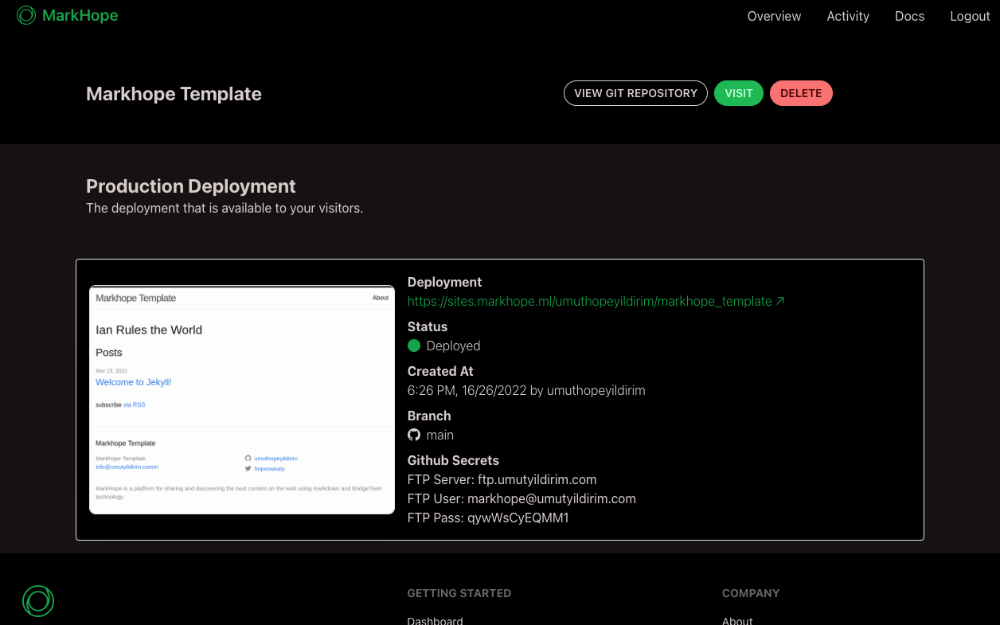
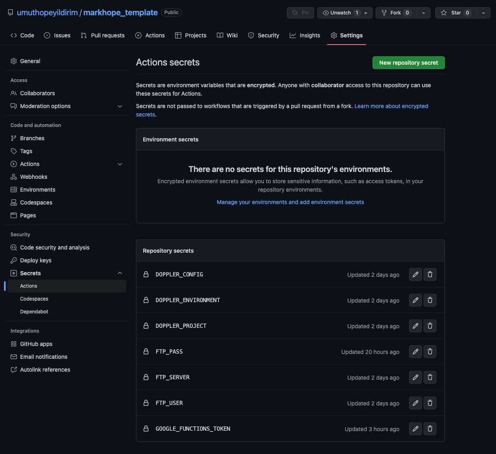

# Github Actions Setup
Markhope uses Github Actions to build and deploy your project.
To setup Github Actions, you need to create a new repository on Github.
Then, you need to add a new secret to your repository.
Secrets can be founded in Settings > Secrets > Actions.
Click on "New repository secret" button.

Find your secrets in MarkHope deployment page.

Copy your secrets and paste them in Github Secrets page.

After importing your secrets re-run your Github Actions workflow.