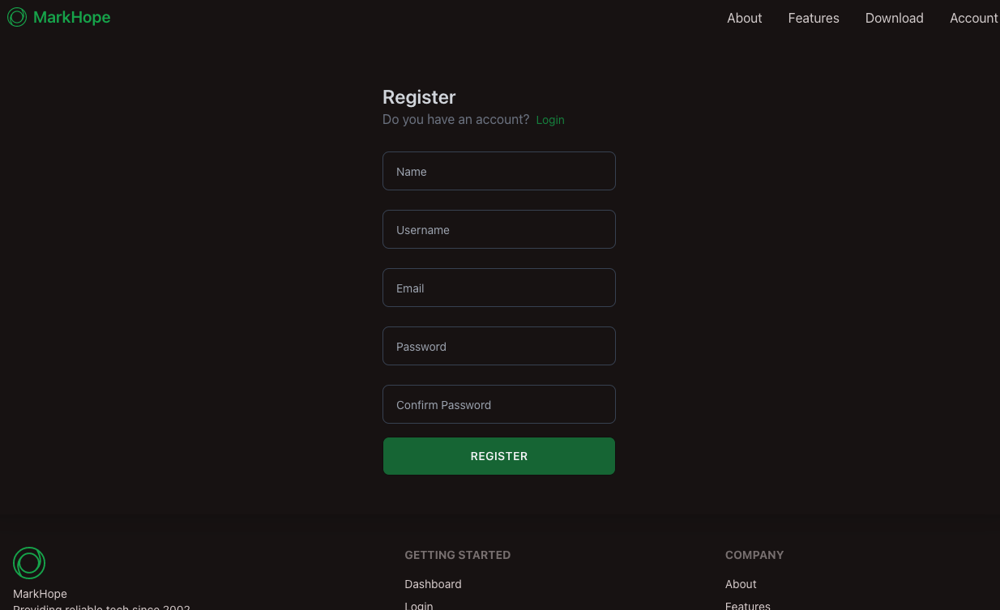
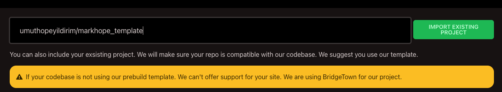
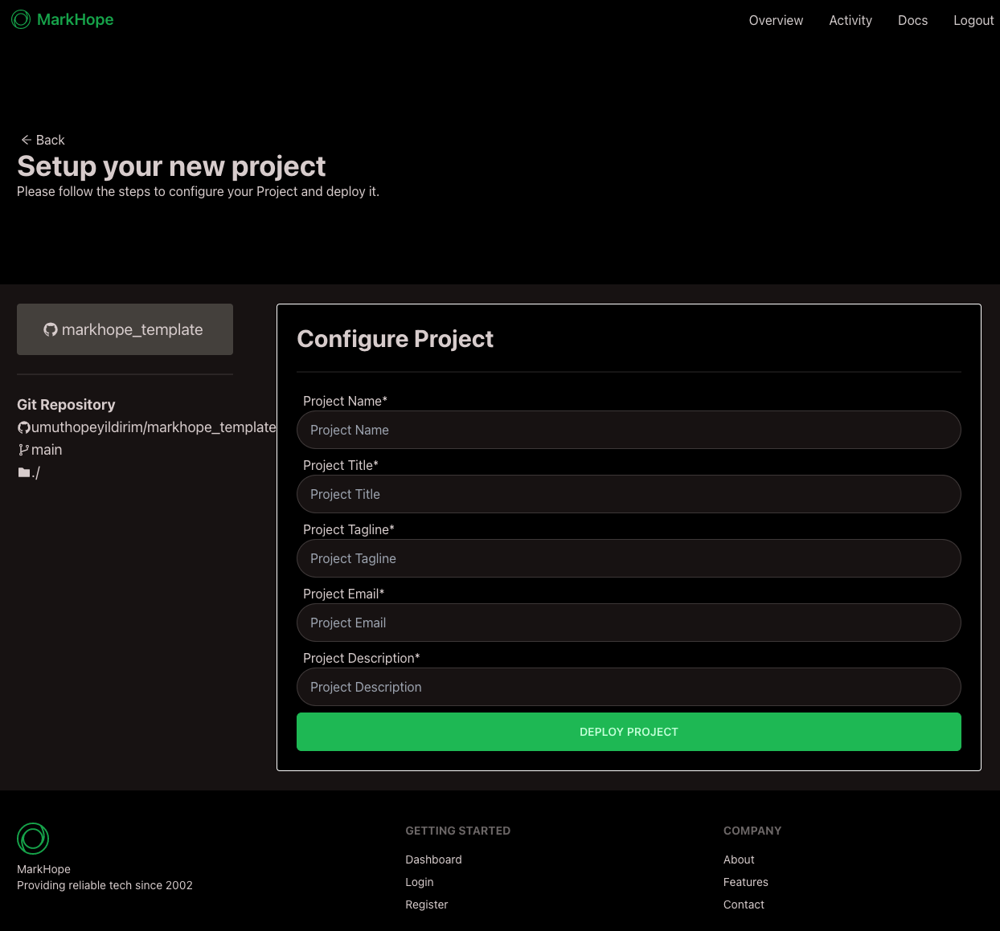

# QuickStart

## Quick Start
Go to [MarkHope](https://markhope.ml/register) website and create an account. 

Then, create a new project.

You need to fork existing [Markhope Template](https://github.com/umuthopeyildirim/markhope_template).

Enter your Github username and repo name and click on "Import Existing Project" button.

Then, you will be redirected to a new page where you can edit your project name, description, and other details.

Enter all required details and click on "Create Project" button.
Congratulations! You have successfully created a new project.
